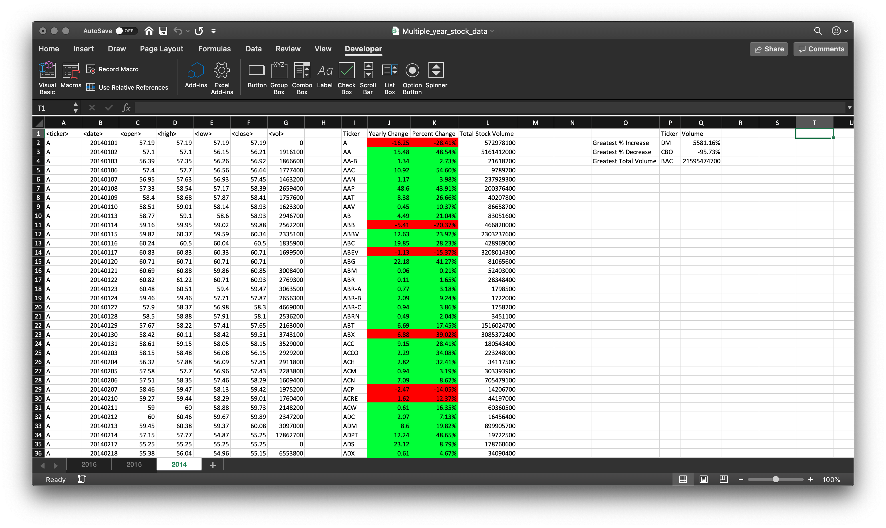
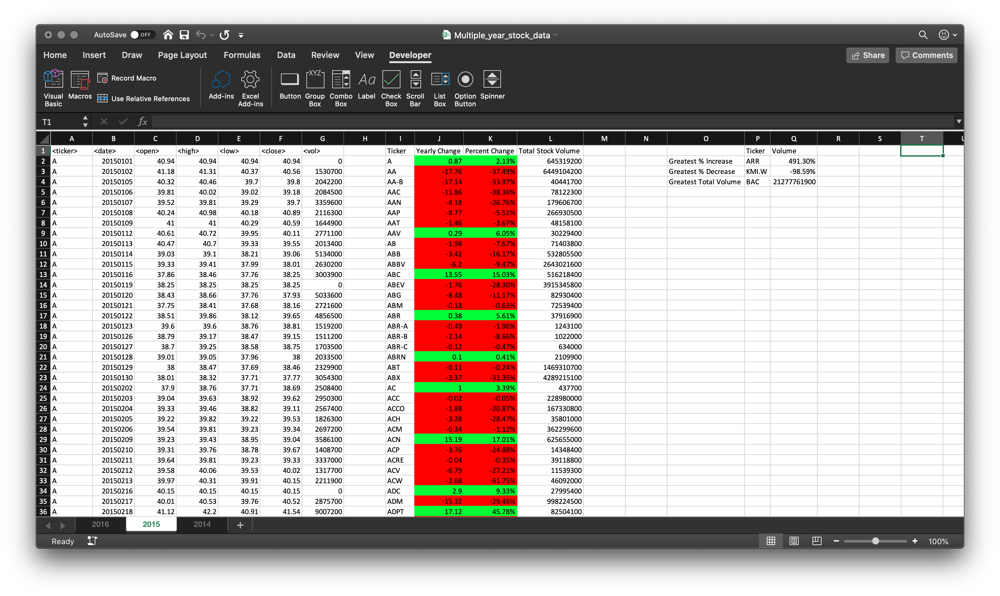
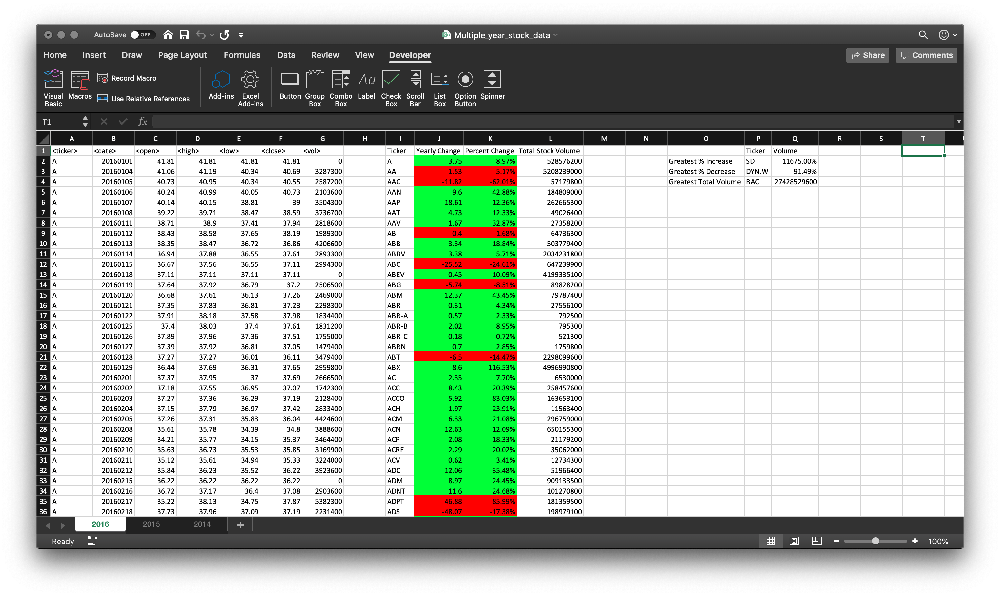

### Background

Use VBA scripting to analyze real stock market data.

### Stock Market Analysis

- Create a script that loops through all the stocks for one year for each run and take the following information:
  - The ticker symbol.
  - Yearly change from opening price at the beginning of a given year to the closing price at the end of that year.
  - The percent change from opening price at the beginning of a given year to the closing price at the end of that year.
  - The total stock volume of the stock.
  - Apply conditional formatting that highlights positive change in green and negative change in red.
  - Return the stock with the `Greatest % increase`, `Greatest % Decrease` and `Greatest total volume`.

### VBA Code

```vb
' Author: David Jaimes
' Web: https://djaimes.com
' Date: 2019 November 20
' Data Science and Visualization
' Description of script: Dear user, if you run FILL_SINGLE_SHEET it will fill the contents of a single sheet in the workbook.
' Otherwise, run WORKSHEET_LOOP to fill in all Sheets in the Workbook.

Sub WORKSHEET_LOOP()
    Dim xsheet As Worksheet
    For Each xsheet In ThisWorkbook.Worksheets
        xsheet.Select
        Call FILL_SINGLE_SHEET
        xsheet.Range("I:Q").Columns.AutoFit
    Next xsheet
End Sub

Sub FILL_SINGLE_SHEET()
    ' Declare all variables for FILL_SINGLE_SHEET sub procedure.
    Dim i, lastrow, counter As Long
    Dim summ, yearlyChange, percentMin, percentMax, volumeMax As Double
    Dim priceFlag As Boolean
    Dim percentMinTicker, percentMaxTicker, volumeMaxTicker As String
    ' Initialize variables before for loop.
    lastrow = cells(Rows.Count, 1).End(xlUp).Row
    counter = 2
    summ = 0
    priceFlag = True
    percentMin = 1E+99
    percentMax = -1E+99
    volumeMax = -1E+99
    For i = 2 To lastrow
        If cells(i + 1, 1).value <> cells(i, 1).value Then
            ' Save unique ticker symbol in column I.
            cells(counter, 9).value = cells(i, 1).value
            ' Calculate Yearly Change and save in column J. Also, highlight cell red (negative) or green (positive).
            closePrice = cells(i, 6).value
            yearlyChange = closePrice - openPrice
            cells(counter, 10).value = yearlyChange
            If yearlyChange < 0 Then
                cells(counter, 10).Interior.ColorIndex = 3
                cells(counter, 11).Interior.ColorIndex = 3
            ElseIf yearlyChange > 0 Then
                cells(counter, 10).Interior.ColorIndex = 4
                cells(counter, 11).Interior.ColorIndex = 4
            End If
            ' Calculate percent change and save in column K. Careful when dividing by zero!
            If yearlyChange = 0 Or openPrice = 0 Then
                cells(counter, 11).value = 0
            Else
                cells(counter, 11).value = Format(yearlyChange / openPrice, "#.##%")
            End If
            ' Save Total Volume in column L.
            summ = summ + cells(i, 7).value
            cells(counter, 12).value = summ
            ' Find the values for greatest decrease/increase and greatest volume.
            If cells(counter, 11).value > percentMax Then
                If cells(counter, 11).value = ".%" Then
                Else
                    percentMax = cells(counter, 11).value
                    percentMaxTicker = cells(counter, 9).value
                End If
            ElseIf cells(counter, 11).value < percentMin Then
                percentMin = cells(counter, 11).value
                percentMinTicker = cells(counter, 9).value
            ElseIf cells(counter, 12).value > volumeMax Then
                volumeMax = cells(counter, 12).value
                volumeMaxTicker = cells(counter, 9).value
            End If
            ' Reset variables and go to next ticker symbol.
            counter = counter + 1
            summ = 0
            priceFlag = True
        Else
            ' Use flag to save the open price value at the start of the year.
            If priceFlag Then
                openPrice = cells(i, 3).value
                priceFlag = False
            End If
            ' If adjacent ticker symbols are the same, then save volume value.
            summ = summ + cells(i, 7).value
        End If
    Next i
    ' Save the values for greatest decrease/increase and greatest volume.
    cells(2, 17).value = Format(percentMax, "#.##%")
    cells(3, 17).value = Format(percentMin, "#.##%")
    cells(4, 17).value = volumeMax
    ' Fill in headers names.
    cells(1, 9).value = "Ticker"
    cells(1, 10).value = "Yearly Change"
    cells(1, 11).value = "Percent Change"
    cells(1, 12).value = "Total Stock Volume"
    cells(2, 15).value = "Greatest % Increase"
    cells(3, 15).value = "Greatest % Decrease"
    cells(4, 15).value = "Greatest Total Volume"
    cells(1, 16).value = "Ticker"
    cells(1, 17).value = "Volume"
    ' Place corresponding ticker symbol to challance values.
    cells(2, 16).value = percentMaxTicker
    cells(3, 16).value = percentMinTicker
    cells(4, 16).value = volumeMaxTicker
End Sub
```

### Stock Market, Yearly Summaries






